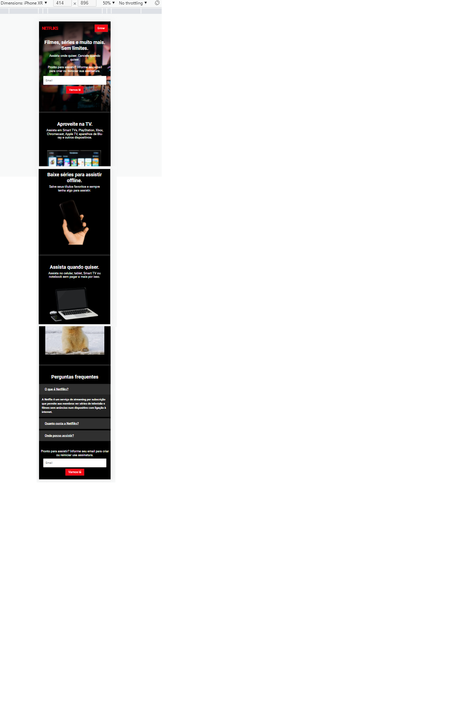
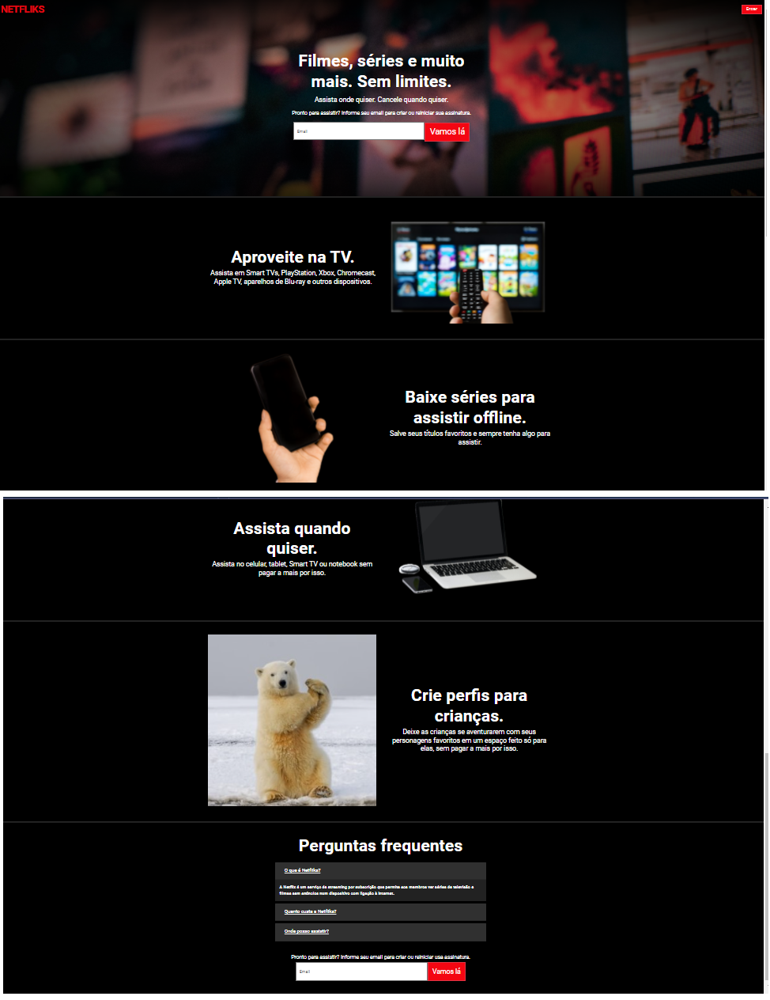

# Recriando interfaces com Bootstrap5

Projeto da mentoria com Vinicius Oliveira do bootcamp TakeBlip.

Neste projeto foi recriado a interface do Netflix utilizando o Bootstrap para construção de layouts responsivos.

No style.css definiu variáveis de cor e fonte. Útil para futuras manutenções.

Na parte de perguntas frequentes foi utilizado o componente Accordion do Bootstrap.

## Extensões

**Live Serve** - cria um servidor

**Color Highlight** - destacar cores no css 

# Viual do projeto

 

    

## Links Úteis

https://getbootstrap.com/docs/5.0/getting-started/introduction/

https://fonts.google.com/

https://unsplash.com/images/stock

https://cssgradient.io/
